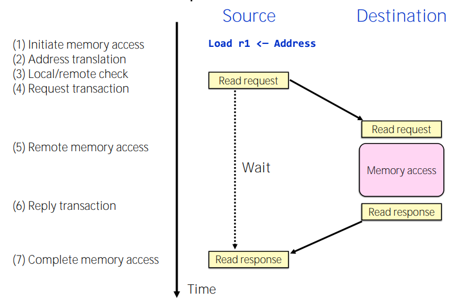
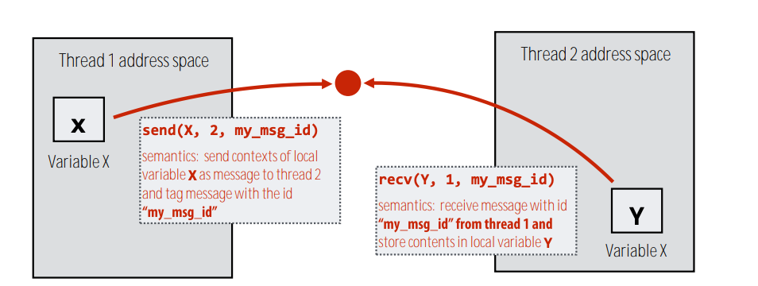
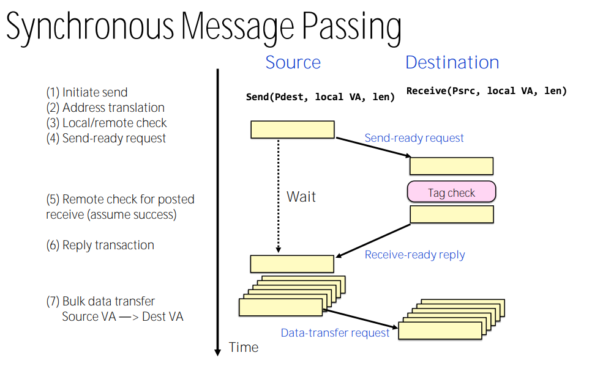
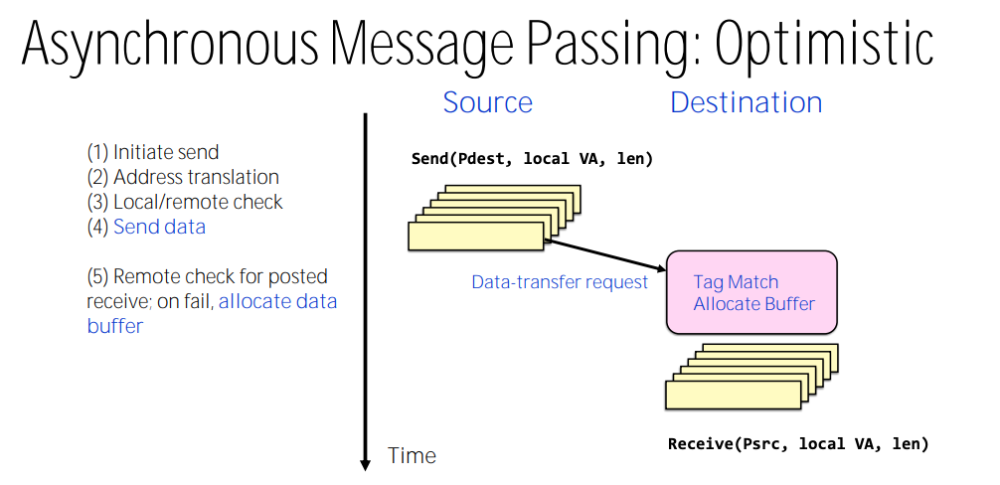
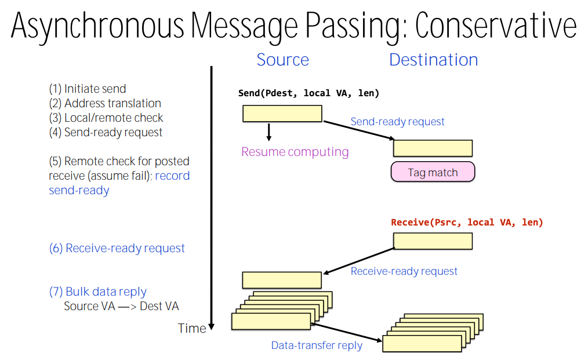

## Implementing Message Passing

### Shared Address Space Abstraction Key Features

- Source and destination addresses are specified by source of the request.
- No storage logically "outside the application address space(s)"

### Private Address Space Abstraction (Message Passing)

- Each thread is operating within their own private memory space, sending/receiving data is the only way to communicate. The synchronization is implicitly achieved when exchanging the data. 
- The sending and receiving operations can be done both in **synchronous** and **asynchronous** ways. 
- Source know the sending address, dest knows the recv address, they know both after shaking hands.
- Arbitrary storage outside the "local address spaces".

 				

The synchronous communication controls the send/recv timing precisely, the program will continue only when such a message passing is finished / failed (call returns only when message passing is finished). Asynchronous communication is more flexible, the call will return immediately without knowing the message passing status, there is a possibility fail the communication in later execution. 

### Chalenge in Message Passing Abstraction

- **Input Buffer Overflow**: requires flow-control on the sources: 1) Reserve space per source 2) refuse input when full 3) drop packets when traffic is too slow.
- **Fetch Deadlock**: The dest must continue accepting messages even when cannot spruce msgs: 1)Logically independent request/reply networks. 2)Bound requests and receive input buffer space. 3)NACK on input buffer full
- **Overall Challenges**: 1) One-way transfer of information 2) No local knowledge and control. 3 ) Very large number of concurrent transactions. 4) input buffer management is difficult.