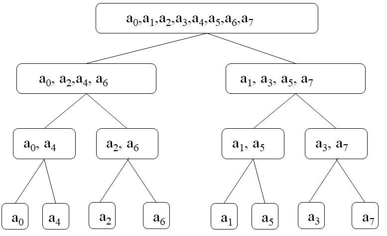
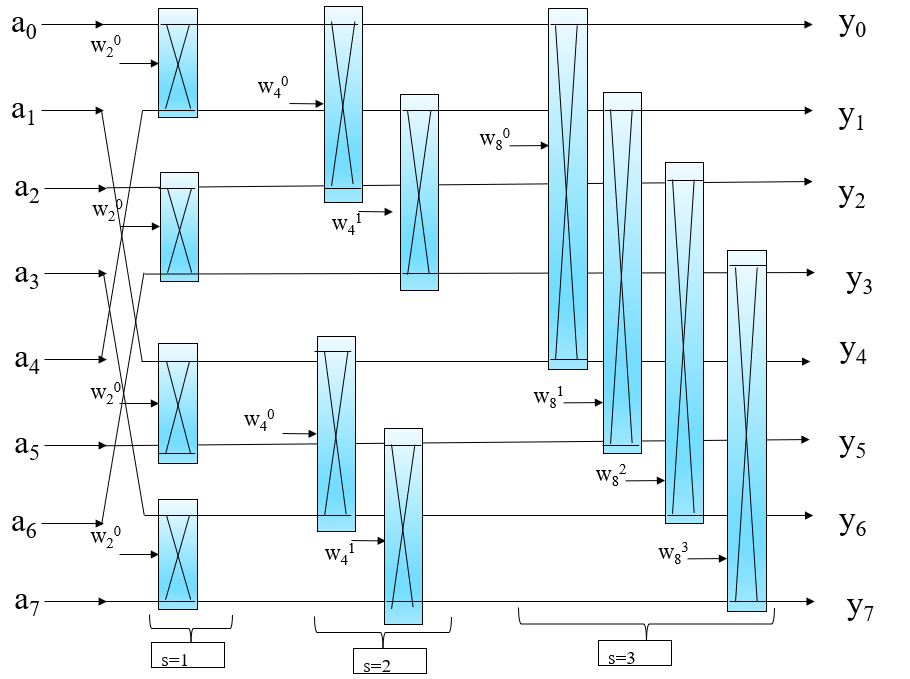
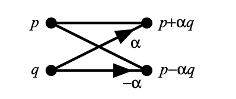
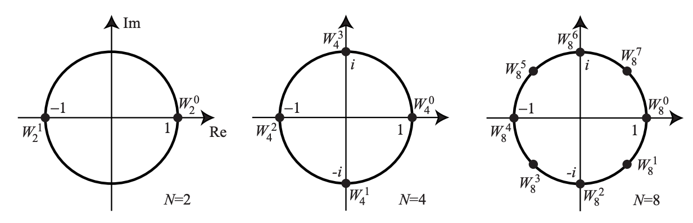
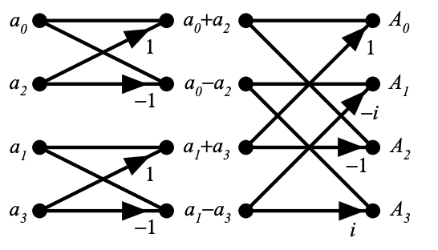
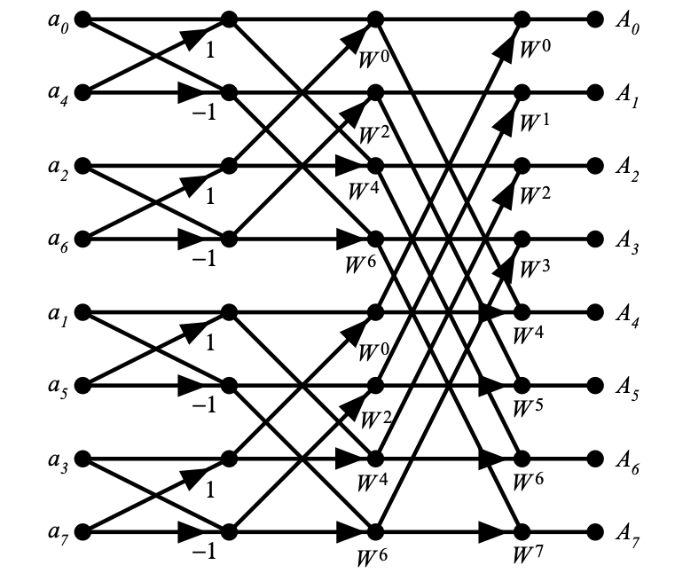

## Butterfly FFT computation in CUDA

I encounter the FFT computation problem in my mmWave Signal Processing Acceleration project. Initially, my teammate implement a well-defined FFT operator in CPU version using butterfly computation method, however, the written CPU version does not specify the parallel features and has very coupled sequential dependency. Therefore, I am trying to re-write the butterfly FFT computation kernel myself in CUDA and making this post for my study record and sharing.

### Background

The FFT (Fast Fourier Transform) algorithm is derived from normal DFT (Discrete Fourier Transform), the algorithm complexity is originally in $O(n^2)$  and then to $O(n*log(n))$. The computation cost decreases dramatically and the precision/correctness does not degrade. A very common way to implement the FFT in computer is the **Butter Fly** computation method, which utilizes the **Divide and Conquer** idea of computer programming.

The underlying mathematic concepts of DFT is solving the numerical complex root solution of polynomial $A(x) = a_0 + a_1x +a_2x^2+...+a_nx^{n-1}$. Denote the transformed array series as  $A(w^0_n),A(w^1_n),A(w^2_n)...A(w^{n-1}_n)$ , where $w^i_n ,i=0,1,2,..,n-1$ is the N roots of equation $W^n=1$.  So, to solve an equation of polynomial with length of N, requires $O(n)$ complexity of every term of the polynomial, the total complexity will be  $O(n^2)$. 

However, if we divide the above polynomial based on the even/odd subscription number into 2 polynomial,  $A_0(x)=a_0+a_2x+a_4x^4+a_6x^4...$  and  $A_1(x)=a_1+a_3x+a_5x^2+a_7x^3...$ , then we have $A(x)=A_0(x^2)+xA_1(x^2)$ . These two divided sequences can then be further divided recursively into further shorter sequences. Also, according to **Binary Lemma**  $W_n^2=w_{n/2}$ , we have  $A(w_n^k)=A_0(w_{n/2}^k)+w_n^kA_1(w_{n/2}^k)$ . Therefore, the original problem is now becoming solving both the odd subscribed sequences and even subscribed  sequences.

Using N = 8 as an example, the division process are illustrated as follows. Suppose we have  $a0,a1,a2,a3,...a8$  8 complex roots, and the sub-sequences are  $A_0=a_0,a_2,a_4,a_6\ \ \ A_1=a_1,a_3,a_5,a_7$ . According to Binary Lemma, we have  A(w_8^k)=A_0(w_4^k)+w_8^kA_1(w_4^k) . The even subscribed sequence is  $A_0(w_4^0),A_0(w_4^1),A_0(w_4^2),A_0(w_4^3)$  and the odd subscribed sequence is   $A_1(w_4^0),A_1(w_4^1),A_1(w_4^2),A_1(w_4^3)$ . The first term of the original DFT sequence (k=0) should be  $A(w_8^0)=A_0(w_4^0)+w_8^0A_1(w_4^0)$ .

The following figure illustrates such a division operation.



The overall solution of DFT is then converted to solving the roots of each single term and then merge together. The merged results, using  $a_0,a_4$  as an example, is  $a_0+w_1^0a_4$  and  $a_0-w_1^0a_4$ . The merged results are then passed upper towards to the original level. This devision requires complexity  $O(log(n))$  and the solving processing will cause  O(n) , the overall time complexity will then become  $O(n*log(n))$ . To better describe such an operation, the scientists use the term "Butterfly Computation" to better feature the divide-merge process, shown below.

  

It is very straightforward, the merge operation in this Butterfly Computation can be done in parallel as there is no dependency in the merged processes as long as we have calculated the forward factor  w_n^k  for each processes.

### Example Illustration

The above background seems very boring, in this part, I will give a detailed example and code snippets to illustrate how did I implement the CUDA butterfly computation fft kernel. I learnt most of the concepts and example from the following link [CMU_butterfly_fft](https://www.cs.cmu.edu/afs/andrew/scs/cs/15-463/2001/pub/www/notes/fourier/fourier.pdf), it is a post from the "Computer Graphics" course in CMU.

#### Butterfly Computation

Firstly, we focus on the fundamental ideal of "Butterfly". Consider the following notation, where  $Output[p] = p+\alpha q, Ouput[q] = p-\alpha q$ . The elements  q,q   are considered as a pair. They cross product with each other, and the lower one will also contribute a coefficient for the corresponding out. The coefficients of the paired and self output are happened to be a pair of opposite number. This kind of operation is a "**Butterfly Computation**". This is the fundamental element in FFT algorithm,



#### Bit-Reversal & 4-point FFT Example

Lets do a review / summary of the mathematical concepts at this time. The DFT formula is written as below. The complete input signal is  $a[n]$  and the corresponding kth output spectrum is  $A[k]$ . In other words, for a complete input signal  a[n] , we have  $FFT(a[k])=A[k]$ . For each element in the input signal, it requires N number of summation to give the exact output. For N elements, it normally require N^2 operations in conventional DFT.


  
$A_k=\sum^{N-1}_{n=0}W_N^{kn}a_n\\
W_N=e^{-i2\pi/N}$
  
However, in our later illustration, we will found that, there are some redundant computation in common DFT, due to the periodicity and complex number features of the DFT formula, which will eventually lead to a simplified FFT algorithm. 

Firstly, we have to understand the term  W_N . Based on the Euler Formula, $W_N^k = e^{-i2k\pi/N}=cos(-2k\pi/N)+jsin(-2k\pi/N)$ . For  $k = 0,1,2..N-1$, we call the  $W_N^k$  the Nth roots of unity, because in the complex arithmetic,  $(W_N^k)^N=1$  is valid for all the k values. A more concrete illustration is shown below, where the points are plot in a unity circle in the complex plane.



Consider a 4-point DFT example, (N=4), rewrite the formula in terms of all the input sequences.


  
$W_4=e^{}-i\pi/2=-i\\
A_k=\sum^4_{n=0}(-i)^{kn}a_n=a_0+(-i)^ka_1+(-i)^{2k}a_2+(-i)^{3k}a_3\\
=a_0+(-i)^ka_1+(-1)^ka_2+i^ka_3$
  
Let's write down all the output.


  
$A_0=a_0+a_1+a_2+a_3\\
A_1=a_0-ia_1-a_2+ia_3\\
A_2=a_0-a_1+a_2-a+3\\
A_3=a_0+ia_1-a_2-ia_3$
  
To compute A quickly, we can re-compute the common subexpressions:


  
$A_0=(a_0+a_2)+(a_1+a_3)\\
A_1=(a_0-a_2)-i(a_1-a_3)\\
A_2=(a_0+a_2)-(a_1+a_3)\\
A_3=(a_0-a_2)+i(a_1-a_3)\\$
  
Now, if we apply the previous mentioned **Butterfly Computation** here, we can have the following plot.



Following the same procedure, we can derive the Butterfly Computation Plot for 8-point FFT.



In the above 2 plots, we can summarize the following properties for the butterfly coefficient and the indices. For the input side, the butterfly computation applied in the adjacent input element, but the index here is not continuous. Also, there is some pattern in finding the butterfly coefficient, for example, only 1 and -1 in the first stage, and only even numbered butterfly coefficients are used in the second stage.

##### Bit-Reversal

The input pattern can be viewed in the binary form. Where the paired index is the binary-reversed version of the input index.

|          Index           | 0    | 1    | 2    | 3    | 4    | 5    | 6    | 7    |
| :----------------------: | ---- | ---- | ---- | ---- | ---- | ---- | ---- | ---- |
|       Paired Index       | 0    | 4    | 2    | 6    | 1    | 5    | 3    | 7    |
|    Index Binary Form     | 000  | 001  | 010  | 011  | 100  | 101  | 110  | 111  |
| Paired Index Binary Form | 000  | 100  | 010  | 110  | 001  | 101  | 011  | 111  |

##### Butterfly Coefficient (Twiddle Factor)

The butterfly Coefficient (also called Twiddle Factor) is related to the current FFT stage and the total number of input elements. For fixed factor $W_N=e^{-i2\pi/N}$ , The absolute value of butterfly coefficient of the input index and current stage is in the following form.


  
$k = (2^{log2(size) - stage}*index)\mod N\\
\theta =-2\pi*k/N\\
W_N^k=e^{-j2\pi*k/N}\\
W_N^k=cos(\theta)+i*sin(\theta)$
  
For the output of the index, pay attention to the paired index and self-index. In CUDA, each thread is representing an input element, which means, every thread has to find their own paired index. This kind of pairing operation can be done by slicing the indices into several groups based on different stages.

```c++
int Wn_k = (1<<(log2(size) - stage)) * idx $ size; // compute the power of twiddle factor
double theta = -2 * PI * Wn_k / size;
Complex_t twiddle;
twiddle.real = cos(theta);
twiddle.imag = sin(theta);
// finding the pair index and corresponding factors for product
int step  = 1 << (stage - 1); // stage is starting from 1
int group_size = 1 << stage;
int lower_bound = (idx / group_size) * group_size;
int upper_bound = lower_bound + group_size;
int pairIdx = idx +step;
// pairIdx may exceed the upper_bound, if so, the paired index should be found in previous element
if(pairIdx >= upper_bound)
  pairIdx = idx - step;
```

### Complete Solution

```c++
__global__ void cudaBitsReverse_kernel(Complex_t *input, int size, int pow)
{
    int idx = blockDim.x * blockIdx.x + threadIdx.x;
    if (idx < size)
    {
        // swap the position
        int pairIdx = bitsReverse(idx, pow);
        if (pairIdx > idx)
        {
            Complex_t temp = input[idx];
            input[idx] = input[pairIdx];
            input[pairIdx] = temp;
        }
    }
}
__global__ void cudaButterflyFFT_kernel(Complex_t *data, int size, int stage, int pow)
{
    int idx = blockIdx.x * blockDim.x + threadIdx.x;
    // Perform butterfly operation for each pair of elements at the current stage
    if (idx < size)
    {
        // calculate butterfly coefficient pow_tester
        int Wn_k = (1 << (pow - stage)) * idx $ size;
        // butterfly coefficient = Wn ^ Wn_k
        // Wn = e^(-2j*pi/Size)
        // Wn ^ Wn_k = e ^ (-2j*pi*Wn_k/Size)
        double theta = -2 * PI * Wn_k / size;
        Complex_t twiddle = {cos(theta), sin(theta)};
        // calculate the pair index and multiplication factor
        int step = 1 << (stage - 1);
        int group_size = 1 << stage;
        int lower_bound = (idx / group_size) * group_size;
        int upper_bound = lower_bound + group_size;
        int pairIdx = idx + step;
        Complex_t product, sum;
        // product = p * a
        product = cudaComplexMul(twiddle, data[pairIdx]);
        // sum = q + (-1) * p * a
        sum = cudaComplexAdd(data[idx], product);
        // data[idx] = q - p*a
        if (pairIdx >= upper_bound)
        {
            pairIdx = idx - step;
            product = cudaComplexMul(twiddle, data[idx]);
            sum = cudaComplexAdd(data[pairIdx], product);
        }
        data[idx] = sum;
    }
    else
    {
        return;
    }
}
```

