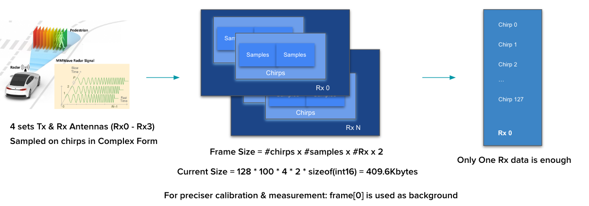
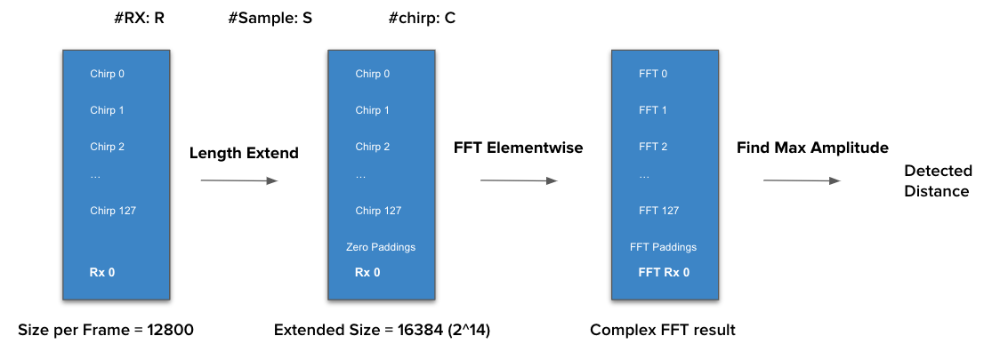
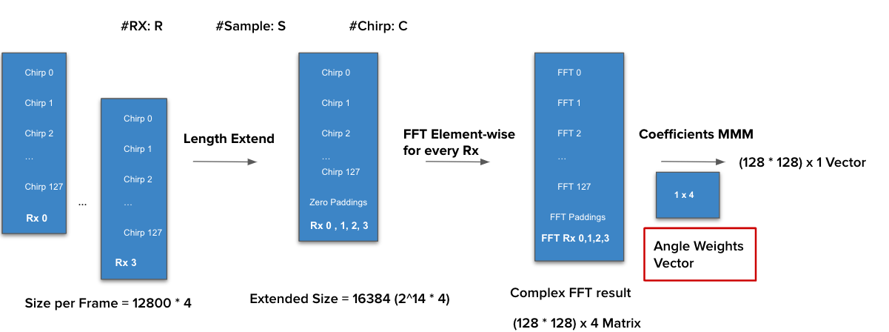
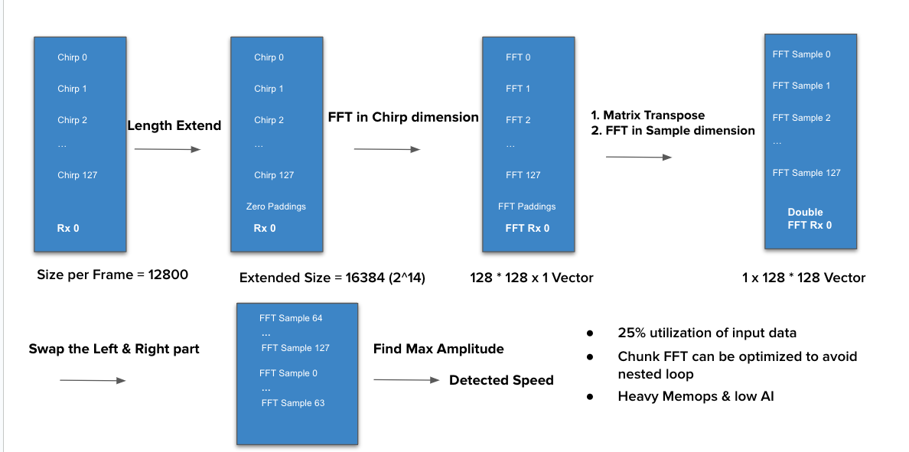

## Summary

In this project, we developed two fully functional mmWave-radar object detection frameworks in both CUDA and OMP parallel programming environments for object distance, speed and angle detection tasks. The CUDA based implementation achieves 5x speed up for all 3 tasks comparing to naive sequential CPU based baseline. On the other hand, the OMP based implementation achieves 2x speed in overall task execution.

This report will firstly illustrate necessary background and implementation knowledge in this project, secondly, we will discuss the implementation approach and related problems that we encountered in the development process. Finally, we will show the obtained results and discuss the further optimization directions.

## Background

mmWave radar is a widely applied device in modern moving object detection for autonomous driving application. At the same time, GPU or CUDA programming provides outstanding throughput and parallelism in modern computational intensive applications. This moving object detection algorithm relays heavily on techniques from signal processing and linear algebra. The important mathematical techniques such as FFT, Dense Matrix Multiplication are all computing-bound applications that have the potential to have better parallelism and achieve better performance in GPU platforms.

The following part will give a detailed introduction for distance, angle and speed detection tasks, however, this report will not give a detailed mathematically illustration but only focus on the parallelizable part of the algorithm and discuss the mathematical properties that may lead to higher performance as well as those that may bottleneck the overall performance.

### Pre-processing & Data Layout

The mmRadar samples the surrounding environment in mmWave analogue signal and then converted to digital signal and finally transmitted to our storage in a binary file format. The binary file read in C program is in 'short' type and in a continuous mixed sequence form, which requires data partition and reshape for later processing.

There are 3 dimensions in the input sequence including sample, chirp and rx. Rx stands for the index of receiving antenna from Radar device, which is a fixed number based on the radar configuration. Sample and Chirp are the dimensions that denote the number format and total size.
The radar module sampled the data in a period of time, in which the stored data is called a frame, and the computation tasks are targeted at specific frames in real-time application.

An ideal data layout after proper processing should be "Rx x Sample X Chirp", which means, for each Rx in each frame there are N numbers of Chirp and S numbers of samples in each Chirp. The total number of data in a single frame should be Num(Rx) * Num(Chirp) * Num(Sample) * 2. The 2 here stands for complex sampling, which requires a pair of short typed numbers to form a complete complex number in later processing.

We firstly partition the paired complex number into the wanted layout using a complicated array partition by pointers in C language. In this stage, the data alignment and reshape requires careful design and attention.
Then, once the data format is satisfied, we have to extend and pad zeros to the end of the processed sequence to make the length of nearest power of 2 due to the requirement of the butterfly-computation based FFT algorithm in a later method. The overall pre-processing schedule is described as the following plot.

### Distance Detection

The overall distance detection is straightforward compared to the following two tasks. For the processed data in each frame, we only use one of the antenna data for distance detection. The data is firstly calibrated based on the Frame[0] data and then fed the calibrated data into the FFT stage. For the output from the FFT stage, the index of the element that has maximum absolute complex amplitude is the number we use to calculate the real-time distance.

The overall procedure of this algorithm is illustrated as follows.

### Angle Detection
Differing from previous distance detection, the angle detection requires all antenna data from the preprocess stage and padding them for the FFT stage. In the FFT stage, the whole input data is transformed in Rx dimension and then multiplied with an initialized angle weights vector. This angle weighs vector requires the found max index from distance detection and uses this index as an estimation index to fetch elements from other 3 antenna data to form the 4 x 1 weights vector.

After the matrix matrix multiplication stage, the output one dimension vector is applied with the same searching algorithm for maximum complex amplitude for angle calculation. The complete flow is shown below. Note that, the matrix matrix multiplication can only be launched when the distance processing is finished. In other words, this angle detection has partial dependency on distance detection.

### Speed Detection

Speed dection is a purely independent process that requires only one attena complete preprocessed data but 2 sequential dependent FFT stages.

At the begining, the data is following the same precedure as distacne detection, however, the FFT is not focusing on the overall Rx data anymore but apply in chirp and sample dimension. In other words, previsouly, all the FFT targeted sequence length is 128 * 128 in our data format, currently the FFT will target at sequence length of 128 chunks consectively which a chunk is a group of 128 elements. In normal application, such a 'ChunkWise' FFT design will involve a for loop, however, in our project, we successfully implemented an one-time luanch chunk targeted FFT kernel to boost our performance. The complete illustration is shown below.

### Butterfly Computation in FFT

The FFT (Fast Fourier Transform) algorithm is derived from normal DFT (Discrete Fourier Transform), the algorithm complexity is originally in $O(n^2)$  and then to $O(n*log(n))$. The computation cost decreases dramatically and the precision/correctness does not degrade. A very common way to implement the FFT in computer is the **Butter Fly** computation method, which utilizes the **Divide and Conquer** idea of computer programming.

The underlying mathematic concepts of DFT is solving the numerical complex root solution of polynomial $A(x) = a_0 + a_1x +a_2x^2+...+a_nx^{n-1}$. Denote the transformed array series as  $A(w^0_n),A(w^1_n),A(w^2_n)...A(w^{n-1}_n)$ , where $w^i_n ,i=0,1,2,..,n-1$ is the N roots of equation $W^n=1$.  So, to solve an equation of polynomial with length of N, requires O(n) complexity of every term of the polynomial, the total complexity will be  $O(n^2)$. 

However, if we divide the above polynomial based on the even/odd subscription number into 2 polynomial,  $A_0(x)=a_0+a_2x+a_4x^4+a_6x^4...$  and  $A_1(x)=a_1+a_3x+a_5x^2+a_7x^3...$ , then we have $A(x)=A_0(x^2)+xA_1(x^2)$ . These two divided sequences can then be further divided recursively into further shorter sequences. Also, according to **Binary Lemma**  $W_n^2=w_{n/2}$ , we have  $A(w_n^k)=A_0(w_{n/2}^k)+w_n^kA_1(w_{n/2}^k)$ . Therefore, the original problem is now becoming solving both the odd subscribed sequences and even subscribed  sequences.

Using N = 8 as an example, the division process are illustrated as follows. Suppose we have  $a0,a1,a2,a3,...a8$  8 complex roots, and the sub-sequences are  $A_0=a_0,a_2,a_4,a_6\ \ \ A_1=a_1,a_3,a_5,a_7$ . According to Binary Lemma, we have  $A(w_8^k)=A_0(w_4^k)+w_8^kA_1(w_4^k)$ . The even subscribed sequence is  $A_0(w_4^0),A_0(w_4^1),A_0(w_4^2),A_0(w_4^3)$  and the odd subscribed sequence is   $A_1(w_4^0),A_1(w_4^1),A_1(w_4^2),A_1(w_4^3)$ . The first term of the original DFT sequence (k=0) should be  $A(w_8^0)=A_0(w_4^0)+w_8^0A_1(w_4^0)$ .

The following figure illustrates such a division operation.

The overall solution of DFT is then converted to solving the roots of each single term and then merge together. The merged results, using  $a_0,a_4$  as an example, is  $a_0+w_1^0a_4$  and  $a_0-w_1^0a_4$ . The merged results are then passed upper towards to the original level. This devision requires complexity  $O(log(n))$  and the solving processing will cause  O(n) , the overall time complexity will then become  $O(n*log(n))$ . To better describe such an operation, the scientists use the term "Butterfly Computation" to better feature the divide-merge process, shown below.

  

 Consider the following notation, where  $Output[p] = p+\alpha q, Ouput[q] = p-\alpha q$ . The elements  q,q   are considered as a pair. They cross product with each other, and the lower one will also contribute a coefficient for the corresponding out. The coefficients of the paired and self output are happened to be a pair of opposite number. This kind of operation is a "**Butterfly Computation**". This is the fundamental element in FFT algorithm,

It is very straightforward, the merge operation in this Butterfly Computation can be done in parallel as there is no dependency in the merged processes as long as we have calculated the forward factor $w_n^k$  for each processes.

A concrete example illustration can be found in [CMU_butterfly_fft](https://www.cs.cmu.edu/afs/andrew/scs/cs/15-463/2001/pub/www/notes/fourier/fourier.pdf), which explains the butterfly algorithm in a greater detail.

The butterfly Coefficient (also called Twiddle Factor) is related to the current FFT stage and the total number of input elements. For fixed factor $W_N=e^{-i2\pi/N}$ , The absolute value of butterfly coefficient of the input index and current stage is in the following form.

$k = (2^{log2(size) - stage}*index)\mod N\\
\theta =-2\pi*k/N\\
W_N^k=e^{-j2\pi*k/N}\\
W_N^k=cos(\theta)+i*sin(\theta)$

## Approach

In this section, we will give detailed explanations on the implementation at the whole application level. The implementation is initially finished in sequential version in single core CPU in GHC machine and later on transplanted to CUDA platform and is accelerated in CUDA kernels for computational intensive parts. Later on, the CUDA implementation is then optimized using CUDA multi stream feature to enable concurrent execution for better throughput. 

### Sequential Implementation

The whole system is designed to compute data frame-wise, which means the system is initially reading a frame size of data from the dataset and feeding the data into processing stages. Once the processing results are calculated the system is then allowed to read the next frame data until the reader reaches the end of the dataset, the whole program is finished.

Sequentially, there are 4 stages in this object detection application including data preprocessing, distance detection, angle detection and speed detection. All these stages are executed sequentially in a single thread in our initial implementation.

In this initial implementation, all the data are stored into arrays and manipulated through naive for-loop. The computational intensive part mainly is the Fast Fourier Transform. The data is swapped based on the binary reverse scheme of the FFT process and then using a nested for-loop to apply sinusoidal transform for every element in the array.

#### PreProcessing Implementation

As stated in the background section, the frame data layout is initially partitioned and reshaped into a series complex number. Firstly, we extract all the data of the Rx dimension from the sample dimension. This process gathers all the sampled data together and layout based on the index of antennas in the sample chunks. Secondly, we then extract all the chirp data based on the chirp index across all the indexed sample chunks and concatenate them together for a complete array for specific Rx.

In above stages, the partition and reshape processes require a nested for-loops for iterating all Rx, Sample and Chirp dimensions. More importantly, the sequence should be paired into complex form before the partition and reshape begin. Moreover, the processed data in each Rx dimension, the data need to be padded to match the requirement that the length of sequence for FFT must be power of 2.

Overall, in conventional sequential implementation, the pre-processing requires 3 sequential dependent for-loops to produce a proper layouted data for later further processing. However, the dependency between each stage is difficult to eliminate, these for-loops have great potential to be fully unrolled in the CUDA platform, where each thread can be assigned  to perform the 3 steps for every element in the input data and store the paired / fetched data into destination memory space. More details will be discussed further in the CUDA parallel implementation section.

#### Distance Detection

Distance is the most straightforward process in all these detection tasks. To obtain the sensed distance, we simply apply FFT to one Rx data instead of four and find the maximum amplitude corresponding index. This index is then used to calculate actual sensed distance in the following formula.

$distance = c*\frac{\frac{Idx} {size_{data}}}{2*\mu}*F_s$

In the above formula, $c$ is the light speed, $F_s$ is the sampling rate and $\mu$ is a constant number in radar sensing. The parallizable workload here is mainly the FFT process, which do get great speedup shown in our later results.

#### Angle Detection

Angle detection is a more complicated task as stated in the background section. Not only because of the sequential dependency that requires the calculated index from distance detection task but also due to its complicated array initialization and operations. 

Before the mathematical operation begins, all rest Rx data except the one used in distance detection must be padded to be the same length for later FFT. Then, the angle weights vector requires a for-loop to be initialized and the matrix-vector multiplication requires a 3-layer nested for-loop to produce the final output. However, the real bottleneck here is the 4 times FFT for every Rx dimension. In our sequential implementation, this FFT operation is done in a for-loop as well as in our CUDA implementation. However, to achieve higher throughput and fully utilize the SIMD feature of the GPU we designed a Matrix-Multiplication kernel specifically for the MMM operation in this stage.

#### Speed Detection

Speed detection is the most computational intensive task in these tasks. There are mainly 2 bottlenecks to achieve high throughput. Firstly, the speed detection requires FFT in Chirp dimension and mirroring swap process for the FFT results. For example, for one Rx data in each frame, with 128 (Chirp) * 100 (Sample) elements. The FFT firstly requires padding the 100 sample elements in each chirp to length of 128. Later on, the FFT will only apply 128 elements in each chirp iteratively. In other words, the FFT will apply iteratively in chirp dimension for all sample elements in this chirp. Once the FFT process is finished, the first left half results will be swapped with the right half results for every chirp.

In our initial implementation, this task invokes a very long nested for-loop for both FFT and results swap. In CUDA implementation, how to decouple the dependency in each chirp data and perform swap efficiently is a challenging task.

### CUDA Parallel Implementation

This section will not discuss fully how these detection tasks are implemented in CUDA code, but focuses on several significant kernel function designs that have been widely applied in all tasks.
To achieve significant throughput, decouple the dependency is the first priority. We firstly designed a preprocessing kernel function that fully unrolls that sequential preprocessing function, where each CUDA thread will calculate the source index and destination index based on the CUDA indexing architecture. Each CUDA thread will first fetch the source index guided short typed data from global memory as the real part of the complex number. At the sametime, it will also fetch the data for the imaginary part based on an odd/even indexed scheme to form a complete complex number and store it into the destination array indexed by the destination index calculated before. When all the pairing and loading operations are finished. The source and destination index is re-calculated based on the Chirp, Sample and Rx mapping relations and copy the paired value from source index into destination index. This thread-level indexing uses the one-to-one mapping between input layout and desired layout to fully unroll the nested loops in sequential implementation of the preprocessing stage.

In similar way, using a one-to-one indexing scheme between input and output, the matrix reshape kernel and matrix-matrix multiplication kernel are well-designed to boost the performance and fully unroll the corresponding for-loops in the sequential implementation.

On the other hand, fast fourier transform is a commonly used function in all tasks. Recall the background of butterfly computation in introduction, the merge operation between each adjacent element in the input sequence is independent. In other words, in the butterfly notation, once the factor for both above and bottle addition is calculated, the merge operation is no longer dependent. To achieve the independent FFT transform, we designed a butterfly-computation based kernel, where each thread calculates its own butterfly factor and corresponding pair index based on the input data size and current FFT stage. Once the pair index and butterfly factor are calculated, simply write the accumulated results back to the result buffer, this FFT stage is finished. This FFT kernel will be launched multiple times based on the input data size that the FFT stage will iterate for $log2(N)$ times to finish all the butterfly operations and compute the final output. 

However, designing a FFT kernel that directly applies FFT for all the input sequences is not enough. The kernel launch and memory migrating are very expensive on the CUDA platform. Therefore, to boost the performance, the kernel should do as much as possible. In a speed detection task, if simply apply the FFT kernel for evry 128 data and iterate the FFT for 128 times, there is a huge cost in both device synchronization and nested iteration. To fully unroll this iteratively FFT for every chirp, we optimized the previous FFT kernel to achieve "chunk based FFT" ability.  

In the "chunk-based FFT kernel", the kernel accepts 1 additional parameter as the chunk size. In this kernel, the input complete sequence is sliced into several chunks based on the chunk size and indexed starting from zero. Therefore, each thread in this kernel will be assigned to a specific chunk based on the CUDA thread index and chunk size. In the assigned chunk, the butterfly factor is calculated based on the chunk size rather than complete input length as well as the pair index is also computed based on chunk size. In general, this "chunk-based FFT kernel" performs "mini FFT '' for each chunk inside the input sequence. This new mapping scheme decouples the chunk indexing dependency in sequential implementation and also avoids expensive cost due to the iterative kernel launching and device synchronization.

### Acceleration in Multistream

Besides the sequential execution of tasks in CUDA framework, CUDA provides an ability to concurrently execute different tasks in a single application using CUDA stream. CUDA stream is an abstraction unit that executes the commands and functions in issued order. In other words, it is possible to schedule several streams at the sametime, and issue the work for each stream asynchronously, where the task execution inside one CUDA stream is done in serial but in SIMD architecture.

In task-level scheduling, we create 4 streams in total for 4 different tasks in this detection application. Each task is further marked by cuda events, which can note the CUDA task execution status inside the CUDA stream. The different stream communicates and synchronize explicitly through CUDA event-wait API calls.

In this application, once the preprocessing stream marks the preprocessing event as finished, the distance stream and speed stream will begin to work but the angle stream only begins until the distance event is marked as end. Once all stream executions are finished, the host side is triggered to proceed to the next frame data and the whole framework continues to work in the same scheduling.

Although the concurrent execution in CUDA multi stream is possible and is fully functional, the actual results compared to normal CUDA sequential implementation is not satisfying.  Due to the problem size of this application and also the heavy scheduling cost of CUDA, this multistream implementation does not gain much performance improvement from concurrent execution. Detailed analysis will be conducted in the results and discussion section.

#### OpenMP Benchmark

Besides the CUDA implementation, we also implement an OMP based CPU framework for better evaluation. We implement OMP in 2 different schemes, one is normal sequential execution between each task and only add OMP pragma inside the detection task. On the other hand, the other scheme implements the distance detection and speed detection in the same OMP region, which will always be paralyzed before the program is executed to the angle detection.

To get a better evaluation of the scalability of our application, we ran the program in both a GHC machine and a PSC machine in OMP implementation. The overall results show that our application may not get great benefits from increasing core counts as the PSC OMP program even runs slower than GHC machines. Detailed analysis will be followed in the results and discussion section

## Results & Discussion

### CUDA Implementation
In our CUDA implementation, the overall speedup reaches 5x than CPU sequential single core execution. However, in OMP implementation, GHC based program achieves 1.8x speedup wherase the PSC based program resolves to even worse performance with 0.42x speedup. The results of CUDA and OMP are shown below. Due to the task complexity and whole project timing constraints, here, we only give task-level speedup comparison. 

Some statistics are not shown here as there is not enough sample to form a complete comparison. For example, FFT is of key interest in hardware acceleration, however, the FFT kernel is called many times in different tasks in both sequential and concurrent execution environments, it is difficult to time the whole FFT kernel execution time precisely.

n the CUDA implementation, the overall speedup saturates at 5x even when we iteratively run the whole program for a long time to amortize the CUDA initialization time. In multistream environment, the overall end-to-end speedup are considered as the same level but different tasks have different speedups.

In default stream execution, the whole program is executed in default stream and host side is explicitly synchronized with CUDA before proceeding to the next task. This explicit synchronization on the host side may lead to performance drop. An evidence is that, in timing the execution in different devices, the resultant throughput measured in CUDA device is 30 FPS more than measured in host device. This difference can be even higher in a multi stream environment. The explicit synchronization in multi stream is much less than default stream implementation, the resultant throughput difference finally reaches 80 FPS. In speedup, setting the end timer in CUDA device will have 5.8x speedup but setting end timer in CPU device will only have 5.x speedup.

On the other hand, CUDA is throughput oriented which suffers from memory allocation and migrating. In a multistream environment, unlike the default stream where there are multiple buffer reuse, to avoid race condition and memory conflicts, there is much more memory buffer allocation and free in the runtime. This dynamic allocation may also result in higher cost and drop the performance.

### OMP Implementation

The speedup results in GHC and PSC do not meet our expectations. Specifically, in PSC, we are expecting to see a performance boost with much more cores. The dropped performance in PSC execution shows that our application has very bad scalability when giving much more computing resources.

Compared to CUDA implementation, OMP implementation only has similar speedup in distance computation tasks, and all other complicated tasks all have very limited performance improvement. In the PSC machine, the OMP enabled speed computation even 10x slower.

One explanation to this result is that the problem size of our application limits the OMP based acceleration. In distance and angle computation tasks, the data size working is from 128*100 to 128 * 100 * 4, but in speedup computation although the overall sequence is 128 * 100, the actual focused data size is 128 each time. As the OMP is spawning all the threads at all time, the synchronization overhead for small problem sizes can be huge and result in very low performance. This also explains why distance and angle computation has better speed up.

Secondly, in all these tasks, the FFT is heavily involved in all the processes, the iterative implemented FFT requires explicit synchronization between threads when the array has read-after-write dependency. This is also cause for lower speedup in OMP scheduling.

If we focus more on the algorithm level, the data layout and size of computation and tasks are fixed. In other words, unlike the N-body simulation problem where the OMP is disabled when the particle size is so small, we can only apply the same scheme at the beginning. The fixed computing scheme of this problem limits the flexibility to dynamically schedule OMP threads.

### Overall

Overall, our problem is following a constrained computing scheme which limits the flexibility in dynamical scheduling. At the sametime, the problem size is not large enough to benefit from a larger core count. In this case, the to acceleration this application, we must re-design the whole system by reconsidering the dependency and efficiency of original algorithms. In this case, CUDA gives more flexibility to implement a new algorithm framework.

In our implementation, although CUBA has great performance compared to OMP, there is still a lot to improve. For example, the dynamic memory allocation can take great overhead in both multistream and default stream implementation. It is possible to allocate all the memory buffers with fixed size statically before entering the CUDA wrapper function. At the sametime, it is also possible to try to read more frames of data and compute them in a single round. This is a great direction to increase our problem size and try to get better performance in OMP scheduling.

